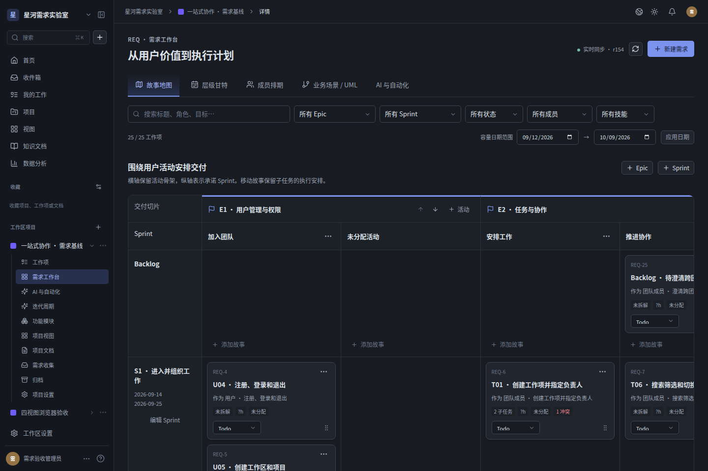
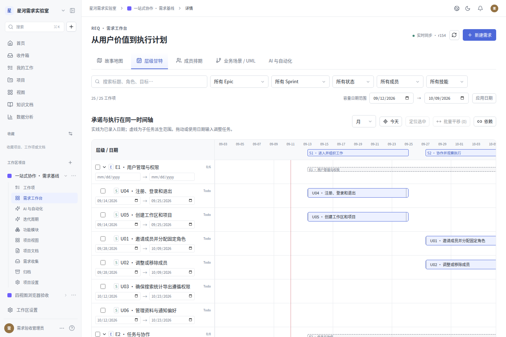
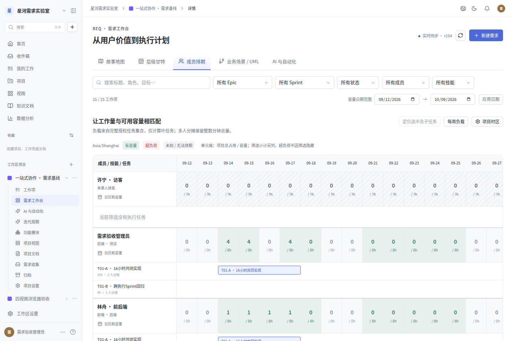
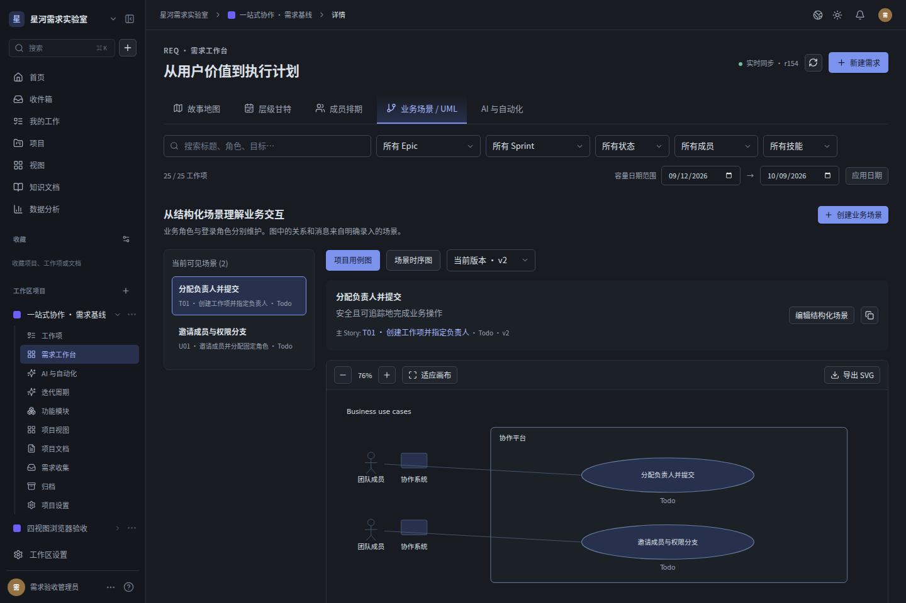
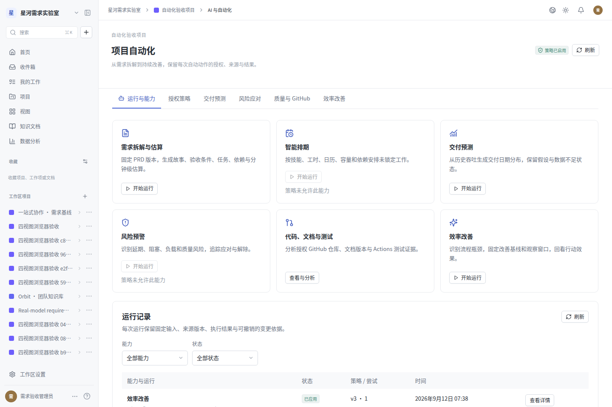
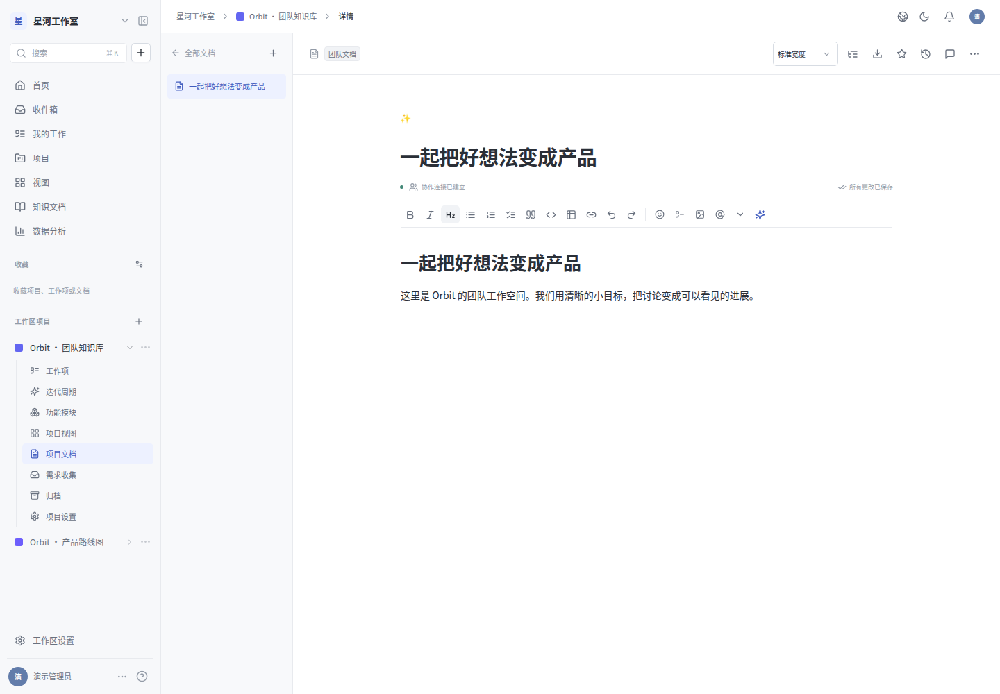
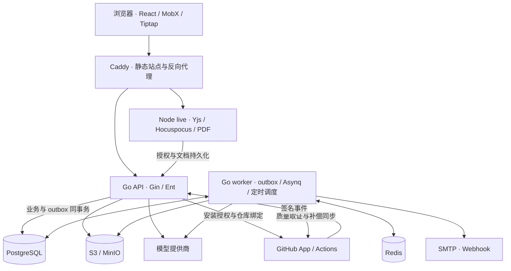

# my-jira

面向团队的需求、项目与协作管理平台。将需求故事、任务执行、成员排期、业务场景和质量反馈放在同一个工作空间，通过共享数据和实时更新连接规划与执行。

项目采用 React / TypeScript 前端、Go 业务后端和独立文档协作服务。目前包含项目协作基础功能，以及覆盖 **37 条用户故事、12 个 Sprint** 的需求基线、四视图和六类分析与自动化流程。实现范围见[需求基线](docs/REQUIREMENTS_BASELINE.md)，实际检查结果见[验证记录](docs/REQUIREMENTS_VALIDATION.md)。

## 核心能力

| 领域 | 当前实现 |
| --- | --- |
| 账号与权限 | 实例初始化、注册登录、成员邀请、工作区与项目成员管理；Admin / Member / Guest 固定角色；私有文档、公开站和 API Token 的独立访问控制 |
| 项目与任务 | 工作项、父子关系与依赖、多人负责人、状态/标签/优先级、Cycle、Module、保存视图；列表、看板、表格、日历和时间线；搜索、筛选及批量操作 |
| 需求工作台 | 显式 Epic / Story / Task、故事叙述与验收条件、用户活动骨架、Sprint 切片和 Backlog；故事地图、层级甘特、成员排期与负载、业务场景 / UML 四视图联动 |
| 资源与排期 | 成员技能、工作日历、日期例外和项目容量；多人工作量分摊、超载与技能冲突；基于依赖、日历、既有负载和截止日期的确定性排期 |
| 文档与协作 | PRD 和富文本文档、多人同步编辑、版本恢复、评论/提及/订阅、附件、通知与邮件；结构化业务场景生成 UML 用例图和时序图，支持 SVG 导出 |
| 分析与自动化 | PRD 拆解与估算、交付预测、智能排期、风险预警与应对、代码/文档/测试质量分析、效率改善与持续观察；策略控制、持久运行记录、差异、取消、重试和撤销 |
| 集成与运维 | 独立 GitHub App / Actions 质量集成、开放 API、Webhook、公开项目互动、CSV/XLSX/JSON 与文档 PDF 导出；版本迁移、健康检查、数据库与对象存储备份恢复 |

四视图共用工作项、统一编辑入口和项目事件流，支持不同页面与会话之间的更新。业务规则包括：

- Story 的 Sprint 和日期表示交付承诺，Task 的 Cycle 和日期表示执行安排；移动 Story 默认保留子任务的执行安排。
- 工时以整数分钟存储、小时展示，只对可执行叶任务计算负载；多人分摊保持总量一致，零容量和未知容量分别处理。
- UML 来自显式编辑的业务参与者、步骤和分支。场景、历史图与导出均受主 Story 及来源当前权限约束。
- 项目可独立开关需求工作台。自动化默认关闭，由管理员设置实体、字段、人员、来源、预算与变更上限后启用；撤销遇到后续人工修改时报告冲突并保留数据。

PRD 拆解调用已配置模型；排期、预测及风险、质量、效率分析还使用确定性算法、规则和已有证据。少于 20 个完成项或不足 4 周历史时，交付预测显示数据不足。质量报告区分失败、跳过、缺失与未知；改善行动保留基线和观察窗口。

## 界面预览

以下图片来自本项目运行中的原创前端和演示数据。需求与自动化截图采集于 2026-09-12，固定视口为 1440 × 960；协作文档截图来自社区功能验收。点击可查看原图。

| 故事地图 · 深色 | 层级甘特 · 浅色 |
| --- | --- |
| [](docs/screenshots/requirements-story-map-dark.png) | [](docs/screenshots/requirements-gantt-light.png) |

| 成员排期与负载 | 业务场景与 UML |
| --- | --- |
| [](docs/screenshots/requirements-members-light.png) | [](docs/screenshots/requirements-scenarios-dark.png) |

| 自动化运行 | 协作文档 |
| --- | --- |
| [](docs/screenshots/requirements-automation-runs-light.png) | [](docs/screenshots/document-editor-light.png) |

## 快速体验：独立演示环境

需要 **Go 1.26、Node.js 22.12+、pnpm 10.24.0、Docker Compose v2**，以及 `make`、Bash。Node.js 推荐使用当前 Node 24 LTS，容器也使用 Node 24。在仓库根目录执行：

```sh
pnpm install --frozen-lockfile
pnpm --filter @myjira/editor-schema build
pnpm exec playwright install --with-deps chromium
make requirements-infra
make requirements-migrate
```

在四个终端分别启动 API、后台任务、文档协作和前端：

```sh
# 终端 1
bash scripts/requirements-test-runtime.sh api
```

```sh
# 终端 2
bash scripts/requirements-test-runtime.sh worker
```

```sh
# 终端 3
bash scripts/requirements-test-runtime.sh live
```

```sh
# 终端 4
bash scripts/requirements-test-runtime.sh web
```

服务启动后，由样例脚本完成首次实例初始化并创建演示数据：

```sh
make requirements-seed
```

打开 **http://127.0.0.1:14173**，使用 `demo@myjira.local` / `MyJira-Local-2026!` 登录，进入「一站式协作 · 需求基线」项目的需求工作台。

样例包含三大 Epic、五个用户活动、三个 Sprint、18 条基线 Story 与 Backlog，以及子任务、跨 Sprint 安排、多人分摊、日历例外、PRD 和业务场景。脚本会输出当前工作区与项目 ID。

此环境使用 `my-jira-requirements-test` Compose 项目、专用数据卷和 `myjira_requirements_test` 数据库。运行脚本提供固定的本地测试配置，无需创建 `.env`；演示账号、存储凭据和加密材料仅用于该测试环境。重复执行 seed 复用既有样例；已有实例的名称必须为 `My Jira Requirements Test`。

| 服务 | 独立演示地址 |
| --- | --- |
| Web | http://127.0.0.1:14173 |
| API / OpenAPI | http://127.0.0.1:18088 / `/api/v1/openapi.json` |
| 文档协作 | `127.0.0.1:13101` |
| PostgreSQL / Redis | `127.0.0.1:35432` / `127.0.0.1:36379` |
| MinIO / 控制台 | http://127.0.0.1:39000 / http://127.0.0.1:39001 |
| Mailpit | http://127.0.0.1:38025 |

浏览器测试和文档 PDF 使用 Chromium；也可通过 `CHROMIUM_PATH` 指定已有可执行文件。完整环境说明、受控模型验证与 worker 恢复探针见[需求与自动化运行说明](docs/REQUIREMENTS_OPERATIONS.md)。

## 常规开发与容器部署

### 使用自己的开发配置

首次使用时，将 [`.env.example`](.env.example) 复制为 `.env`，已有配置应保留。将 `openssl rand -base64 32` 生成的值填入 `APP_ENCRYPTION_KEY`；它必须是 **Base64 编码的 32 字节密钥**，用于加密实例服务凭据。`make` 会加载根目录 `.env`。

完成上面的依赖安装和共享编辑器包构建后，等待基础设施就绪并执行迁移：

```sh
docker compose up -d --wait postgres redis minio mailpit
make migrate
```

再分别在四个终端运行 `make api`、`make worker`、`make live`、`make web`。默认前端为 http://127.0.0.1:4173，API 为 `8088`，协作服务为 `3101`。

首次打开页面可手动创建实例管理员和工作区。如果需要普通项目的中文演示数据，应先运行 `make seed`，由脚本完成初始化；已初始化的实例需通过 `MYJIRA_DEMO_EMAIL` / `MYJIRA_DEMO_PASSWORD` 提供已有管理员账号。普通 seed 创建 ORBIT 项目，需求演示使用上一节的独立 seed。

### Docker Compose

配置好 `.env` 后执行：

```sh
make app
```

默认访问 http://127.0.0.1:4180。Compose 构建 Web、Go API/worker 和 Node 协作镜像，先运行一次性 `migrate`，成功后启动应用。Caddy 提供静态前端并转发 API、SSE 和 WebSocket。此方式使用常规 `my-jira` Compose 数据卷；`make app-stop` 停止应用进程并保留数据。

使用 `APP_PORT` 配置监听端口，`DEPLOY_ORIGIN` 配置浏览器访问地址。对外部署需配置实际域名、TLS 和独立服务凭据。若要给容器实例生成普通演示数据，同时指定 API 和页面来源地址：

```sh
make seed MYJIRA_API_URL=http://127.0.0.1:4180 MYJIRA_APP_ORIGIN=http://127.0.0.1:4180
```

Go 模块源受限时，可单独构建：

```sh
docker compose -f compose.yaml -f compose.app.yaml build --build-arg GOPROXY=https://goproxy.cn
```

### AI 与 GitHub 配置

当前实例固定使用 `gpt-5.6-terra` 和 Responses 接口。AI 环境默认配置读取 `AI_BASE_URL` 和 `MINE_API_KEY`；本机直接运行的 API/worker 支持密钥回退到 `AI_API_KEY`，Docker Compose 仅传入 `MINE_API_KEY`。接口地址和凭据也可在实例管理的 AI 设置中保存，存储值经过加密并覆盖环境默认配置。修改 `.env` 中的 `AI_MODEL` 不会切换当前模型。

独立演示脚本直接运行时不加载根目录 `.env`，可选的模型密钥和 `CHROMIUM_PATH` 应在对应启动终端中导出。基本功能与需求样例不要求配置模型或 GitHub 凭据。

GitHub 质量分析使用独立 GitHub App，与 GitHub 登录 OAuth 分开配置。需要 `GITHUB_APP_ID`、`GITHUB_APP_SLUG`、`GITHUB_APP_PRIVATE_KEY`、`GITHUB_APP_CLIENT_ID`、`GITHUB_APP_CLIENT_SECRET`、`GITHUB_WEBHOOK_SECRET`。本机进程以应用公开地址设置 `APP_URL`；Docker Compose 设置 `DEPLOY_ORIGIN`，由部署配置映射为 `APP_URL`。

- Setup URL 与 OAuth Callback URL：`APP_URL/api/v1/github/callback`。
- Webhook URL：`APP_URL/api/v1/github/webhook`。
- 关闭 GitHub 的「Request user authorization during installation」；平台在 setup 回调后发起带 PKCE 的 OAuth 授权。

接入后读取授权仓库和 Actions 产物，记录固定 SHA、run/attempt、产物摘要和文档版本，不执行仓库代码。App 权限、绑定和撤销规则见[质量集成说明](apps/api/internal/quality/README.md)。

## 技术架构

前端使用 React、TypeScript、Vite、React Router、MobX 和 Tiptap。业务后端是 Go / Gin / Ent 模块化单体，使用 PostgreSQL；Redis / Asynq 承载后台任务；Node / Yjs / Hocuspocus 负责文档协作；附件和导出文件存于 S3 兼容对象存储。



四视图通过 Go SSE 接收持久项目事件，文档协作通过 Yjs 同步。HTTP 与自动化共用工作项业务命令，版本检查、授权复查、审计和 outbox 在事务内执行。浏览器、公开站、实例管理、外部 API 和 GitHub 入站事件保持各自授权边界。数据库由显式版本迁移更新，API/worker 启动时不修改 schema。

```text
apps/web/                 Web、公开页面、实例管理、需求与自动化界面
apps/api/internal/        业务领域、权限、API、分析与后台任务
apps/api/migrations/      版本化 SQL 迁移与旧数据升级测试
apps/live/                文档协作、持久化适配和 PDF 渲染
packages/editor-schema/   Web 与协作服务共用的文档结构
tests/                    Playwright 用例与固定 PRD 样例
scripts/                  样例数据、验收环境、提供商验证和备份恢复
docs/                     需求基线、契约、架构、验证记录与截图
```

## 验证

当前实现的验证记录日期为 **2026-09-12**。以下结果来自仓库内已有证据，并分别标明自动检查、实际服务与效果验证：

| 检查层次 | 已记录结果 |
| --- | --- |
| Go、数据库与存储 | 178 个顶层测试通过；含子测试 245 个通过，无失败或跳过；使用隔离 PostgreSQL 和 MinIO |
| Web / 协作服务 | Web 36 个测试、live 4 个测试通过；类型检查、构建和 `go vet` 通过 |
| 浏览器与视觉 | 新增流程 7 个用例、社区回归 13 个不同用例取得通过证据；10 张需求与自动化浅深主题截图 |
| 迁移与恢复 | 真实 0008 → 0015 升级、对象存储恢复、worker 停止后同一运行恢复及幂等重放通过 |
| 真实模型 | 有界合成 PRD 共调用 3 次：初次和增量成功应用，一次无效父级被安全拒绝；保留原 ID 和人工修改，整体证据为 `partial` |
| 尚未验证 | 真实 GitHub / Actions 链路、真实历史预测准确性、团队改善效果、生产容量与高可用 |

重跑静态检查、前端与协作测试和构建：

```sh
make check
pnpm -r --if-present test
make build
```

使用独立演示基础设施运行完整 Go 集成测试；此目标显式提供测试数据库和对象存储配置：

```sh
make requirements-infra
make requirements-integration
```

按「快速体验」启动并 seed 后，运行新增浏览器流程：

```sh
E2E_BASE_URL=http://127.0.0.1:14173 pnpm exec playwright test \
  tests/e2e/requirements.spec.ts tests/e2e/requirements-automation.spec.ts
```

`make test` 会加载 `.env`，可能直接执行其中 `TEST_DATABASE_URL` 对应的 PostgreSQL 测试；未配置数据库或相应存储参数时，依赖这些服务的测试会跳过。完整集成验收使用上述专用目标。切换社区浏览器样例可用 `E2E_WORKSPACE_ID` / `E2E_PROJECT_ID`，切换邮件测试服务可用 `E2E_MAILPIT_URL`。

另外，`make verify-installation` 使用另一套独立 bootstrap Compose 环境验证空实例初始化和队列恢复，使用 4181 等专用端口，完成后清理其临时数据卷。具体执行范围见[社区功能验证记录](docs/VALIDATION.md)；新增功能以[需求与自动化验证记录](docs/REQUIREMENTS_VALIDATION.md)为准。本地检查和选定输入的真实调用不代表生产或一般准确性验证。

## 文档与维护

| 文档 | 内容 |
| --- | --- |
| [需求基线](docs/REQUIREMENTS_BASELINE.md) / [三阶段迭代计划](docs/ITERATION_PLAN.md) | 37 条故事、Sprint、依赖、验收与证据追踪 |
| [需求与自动化运行说明](docs/REQUIREMENTS_OPERATIONS.md) | 专用环境、项目开关、自动化、GitHub、迁移与运行观察 |
| [OpenAPI 3.1](docs/openapi.json) / [API 协议](docs/API_CONTRACT.md) | 路由、输入输出、权限、筛选、分页、版本与异步状态 |
| [架构决策](docs/ARCHITECTURE.md) / [数据库结构](docs/DATABASE.md) | 技术边界、事务、数据模型与版本迁移 |
| [社区功能矩阵](docs/FEATURE_PARITY.md) / [差距与边界](docs/PARITY_GAPS.md) | 原社区基准的实现范围及验证边界 |
| [开发与备份恢复](docs/DEVELOPMENT.md) | 常规端口、数据归属、备份与独立恢复步骤 |

OpenAPI 同时由 `/api/v1/openapi.json` 提供。接口变更后，在 `apps/api` 运行 `go run ./cmd/openapi -output ../../docs/openapi.json` 更新生成契约。

`make backup` 生成数据库 dump、对象文件、元数据与校验清单；`make verify-backup SNAPSHOT=/absolute/snapshot/path` 在独立数据库和 bucket 中验证恢复。数据库与对象存储的一致备份需要协调写入，加密密钥另行安全保存。

项目以 Plane 社区提交 `1fec307f91003df96351557af32ce87891a3678a` 的已实现功能作为参考，并在此基础上实现需求工作台与自动化扩展。应用代码、组件、样式、文案和资源独立编写，API 与数据库采用本项目自己的协议；业务运行时不依赖 Django。原始社区实施范围见[社区复刻计划](docs/PLAN.md)。
