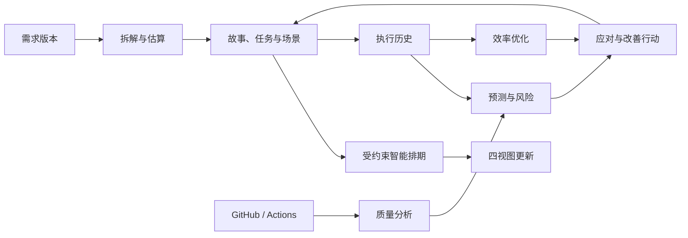

# my-jira 三阶段全量迭代计划

本计划覆盖 `requirements.md` 的全部内容：进阶1形成可执行需求基线，进阶2实现四视图一体化，进阶3实现六类 AI 能力及持续优化闭环。三个阶段共同构成最终交付范围。

计划包含 **37 条用户故事、12 个 Sprint**。现有功能按复用和补充验证处理，新增功能按依赖顺序实施。

## 一、当前判断与已确认决策

当前项目具备账号与固定角色、工作区和项目、工作项、负责人、父子关系和依赖、普通看板、甘特、Cycle、协作文档、统计与文本 AI 等基础。

当前主要缺口是：

| 阶段 | 已有基础 | 必须补齐的内容 |
| --- | --- | --- |
| 进阶1 | 用户管理、任务协作、基础统计 | 三大 Epic 的完整故事基线、至少三个 Sprint 切片、验收条件、依赖与证据追踪 |
| 进阶2 | 工作项、普通看板、甘特、负责人和周期 | 用户故事地图、成员排期与负载图、结构化业务场景、UML 用例图与时序图、四视图实时联动 |
| 进阶3 | 文本生成接口、历史活动、异步任务队列 | 结构化拆解与估算、交付预测、智能排期、风险应对、代码/文档/测试质量分析、效率优化与自动执行闭环 |

当前会话已通过 Web 10 项、协作服务 4 项、Go 基础与契约测试，以及 AI 响应解析测试。这些结果证明已有基础的相应检查通过；新增需求仍需独立验收。

以下决定已经确定，后续实施直接遵循：

| 决策项 | 采用方案 |
| --- | --- |
| 全量范围 | 覆盖三个进阶 |
| 进阶1交付 | 实验需求基线文档、切片、验收与追踪 |
| 权限角色 | 保留 Admin、Member、Guest；将“创建角色”解释为“分配现有角色” |
| 用户故事视图 | 用户故事地图，按用户活动组织骨架，以 Sprint 划分切片 |
| 成员任务视图 | 成员排期与负载图 |
| UML 来源 | 结构化业务场景，后续允许 AI 辅助填写 |
| AI 应用方式 | 项目管理员启用后，在项目约束内自动应用 |
| 排期依据 | 工时、成员技能、工作日历与项目可用容量 |
| 质量数据源 | GitHub、GitHub Actions、平台需求与文档 |
| 技术栈 | 沿用现有 React、Go、PostgreSQL、Redis/Asynq、Node 协作服务和对象存储 |

“项目经理”作为业务人物使用现有权限角色。产品代码和资源继续独立开发，Plane 参考保持只读。

## 二、进阶1：完整需求基线

### 2.1 文档交付

形成以下正式文档：

- `docs/REQUIREMENTS_BASELINE.md`：产品目标、用户人物、三大 Epic、37 条故事、故事地图、Sprint 分配、验收条件与追踪矩阵。
- `docs/ITERATION_PLAN.md`：本计划全文、实施依赖、接口与数据变更、验证和交付要求。

既有计划和功能矩阵增加新需求入口，明确原有“完成”状态适用于 Plane 社区复刻范围。

每条故事统一记录：

`故事ID、Epic、角色、目标、业务价值、优先级、前置依赖、Sprint、负责职能、验收条件、实现状态、自动验证、浏览器证据、外部服务证据、风险或缺口`。

三大 Epic 固定为：

- **E1 用户管理与权限**：让正确的人获得正确的操作和数据访问能力。
- **E2 任务与协作**：把需求转化为可分配、可执行、可协作和可追踪的工作。
- **E3 数据与分析**：让项目状态、交付风险、质量和改善效果有可解释的依据。

### 2.2 前三个 Sprint 的完整故事切片

这18条故事形成进阶1的实验基线。已有实现逐条关联代码与现存证据；缺失证据明确登记。

| ID | 用户故事与价值 | Sprint | 核心验收 |
| --- | --- | --- | --- |
| U04 | 用户注册、登录和退出，以便安全进入协作空间 | S1 | 身份验证、会话建立与退出有效，错误身份不能访问受保护资源 |
| U05 | 获准成员创建工作区和项目，以便建立协作范围 | S1 | 创建、成员归属、项目可见性及基础配置持久化 |
| T01 | 团队成员创建工作项并指定负责人，以便明确责任 | S1 | 标题、状态、优先级、负责人、日期和估点保存后保持一致 |
| T06 | 团队成员搜索、筛选和切换工作视图，以便找到所需任务 | S1 | 相同筛选作用于正确集合，分页和详情定位准确 |
| D01 | 项目经理查看总量、状态和完成分布，以便掌握项目现状 | S1 | 指标与固定样例明细一致，统计范围明确 |
| D05 | 项目经理查看成员任务分布，以便了解责任分配 | S1 | 负责人维度与明细一致，多负责人计数口径明确 |
| U01 | 管理员邀请成员并分配固定角色，以便建立可控团队 | S2 | 邀请可接受，Admin、Member、Guest 的实际权限符合规则 |
| U02 | 管理员调整或移除成员，以便维护访问范围 | S2 | 权限变更后，后续读取和写入按新权限执行 |
| T02 | 团队成员拆分任务、维护依赖并更新状态，以便推进执行 | S2 | 父子与依赖不能成环，关联变更和状态更新持久化 |
| T04 | 团队成员评论、提及、订阅和共享附件，以便协同处理工作 | S2 | 协作内容可恢复，通知与附件读取遵守当前权限 |
| D02 | 项目经理按成员、周期和日期查看趋势，以便发现执行变化 | S2 | 筛选一致，创建/完成趋势的计算口径有说明 |
| D04 | 项目经理查看周期和模块进度，以便检查阶段目标 | S2 | 当前进度、估点和分布与明细一致，历史统计边界明确 |
| U03 | 管理员确保搜索、统计和导出遵循当前权限，以便控制数据访问 | S3 | 撤权后集合、统计、导出与下载入口同步受限 |
| U06 | 用户管理资料与通知偏好，以便适配个人协作方式 | S3 | 偏好保存和重载一致，不改变其他用户的配置 |
| T03 | 团队将工作纳入三个 Sprint 并维护日期，以便形成可执行切片 | S3 | Cycle 归属与日期持久化，冲突写入不覆盖他人修改 |
| T05 | 团队维护 PRD 和协作文档，以便保留需求依据 | S3 | 多人协作、版本、私有范围、锁定与恢复行为可追踪 |
| D03 | 项目经理保存和导出分析，以便开展复盘 | S3 | 保存条件可重载，导出与同条件查询结果一致 |
| D06 | 团队追踪需求与验收覆盖，以便判断基线完整性 | S3 | 每项需求关联故事、Sprint、验收条件和独立证据状态 |

S1 目标是“能够进入并组织工作”；S2 目标是“能够协作并观察执行”；S3 目标是“能够形成交付切片并复盘”。

文档故事地图采用“加入团队→安排工作→推进协作→检查进展→复盘改进”的活动骨架，以 S1–S3 划分纵向切片。

### 2.3 基线完成条件

- 三个 Epic 在三个 Sprint 中均有可验收故事。
- 所有故事都有角色、目标、价值、依赖和完成条件。
- 37 条故事均进入总基线，后续阶段的新增故事由下文定义。
- 已实现、待补实现、已验证和未验证分别登记。
- 基线通过 Git 保存版本；变更记录说明影响的故事、Sprint、接口和验收条件。
- 本阶段交付文档、样例数据说明、演示步骤及证据映射。

## 三、进阶2：四视图一体化

本阶段新增9条故事：

| ID | 所属 Epic | 用户目标 |
| --- | --- | --- |
| U07 | E1 | 维护成员技能、日历和项目可用容量，并控制修改权限 |
| U08 | E1 | 在四视图、业务场景和图导出中保持一致的访问边界 |
| T07 | E2 | 维护明确的 Epic、Story、Task 与验收条件 |
| T08 | E2 | 用故事地图组织用户活动和 Sprint 切片 |
| T09 | E2 | 用甘特查看层级、依赖、承诺窗口和执行日期 |
| T10 | E2 | 用成员时间泳道分配工作并检查负载 |
| T11 | E2 | 维护业务场景并自动生成 UML 用例图与时序图 |
| T12 | E2 | 在不同视图、页面和会话中得到一致更新 |
| D07 | E3 | 识别日期、依赖、容量和交付承诺之间的冲突 |

### 3.1 统一业务语义

| 概念 | 规则 |
| --- | --- |
| Epic / Story / Task | 在现有工作项上增加可选的需求类型与扩展信息；新分类对象具有明确层级，旧工作项不按名称自动分类 |
| 用户故事 | 保存角色、目标、价值、验收条件、Epic、用户活动及地图顺序；状态和负责人仍使用工作项字段 |
| 用户活动 | 构成故事地图横向骨架，按顺序排列并按 Epic 组织 |
| Sprint | 复用 Cycle，未分配 Cycle 的故事位于 Backlog |
| Story 的 Sprint | 表示交付承诺 |
| 子任务的 Sprint | 表示执行归属；创建时默认继承 Story，之后可以独立调整 |
| 日期 | Story 日期表示承诺窗口；子任务日期表示执行安排；派生汇总日期不作为第二份可编辑真值 |
| 工时 | 预计和剩余工时独立于故事点，以整数分钟保存、小时展示 |
| 依赖 | 复用现有规范化阻塞关系；一般关联和重复关系不产生排期约束 |
| 业务参与者 | 用于描述被建模业务的角色和系统，与平台登录角色分别维护 |

移动 Story 的 Sprint 默认更新承诺归属和地图位置，保留子任务日期及执行周期。提供明确的批量转移、平移操作，由用户选择影响对象后原子提交。

Cycle 可以重叠，因此系统不根据日期猜测 Sprint 归属。

### 3.2 用户故事地图

提供完整的组织与执行入口：

- 创建、编辑、排序和归档 Epic、用户活动及 Story。
- 展示用户活动横轴、Sprint 泳道和 Backlog。
- 编辑故事叙述、验收条件、优先级、状态、负责人和子任务。
- 支持格内排序、跨活动移动、跨 Epic 移动和跨 Sprint 移动。
- 支持 Epic、Sprint、状态、负责人和关键词筛选。
- 保留空活动和空 Sprint，展示未分配、未拆解和存在冲突的故事。
- 拖动提供键盘或菜单替代操作。
- 删除存在故事的活动前先迁移故事，避免级联丢失工作项。
- 从卡片打开统一详情面板，并定位对应甘特、成员分配和业务场景。

故事状态是独立维度。移动 Sprint 修改承诺归属；修改状态驱动任务进度和剩余负载变化。

### 3.3 甘特图

扩展现有甘特，实现：

- Epic、Story、Task 的层级展示、展开与折叠。
- Sprint 边界、Story 承诺窗口、子任务日期汇总和偏差展示。
- 未排期集合、定位今天、定位选中对象及周/月/季度缩放。
- 任务日期录入、拖动、两端调整及选定任务批量平移。
- 依赖线、依赖增删、防环校验和日期冲突提示。
- 从冲突提示定位前置任务、目标日期或成员分配。
- 派生的 Story 汇总条通过其子任务调整，不直接改写汇总结果。

进阶2自动同步字段、汇总和冲突；自动重新安排其他任务由进阶3的排程器执行。

### 3.4 成员排期与负载图

成员为行、日期为横轴，同时展示任务条和每日/每周负载。

提供：

- 成员技能、工作日历、休息日、日期例外及项目可用容量维护。
- 预计/剩余工时和负责人分摊编辑。
- 跨成员分配、共同负责人、日期调整和任务详情。
- 超负荷构成、技能不匹配及未分配、未估算、未排期集合。
- 按成员、技能、Sprint 和状态筛选。

负载计算遵循以下规则：

1. 每个任务只有一份剩余工作量，多负责人分摊总和必须等于该工作量。
2. 初次多人分配默认均分，允许调整比例；舍入余数按稳定顺序分配。
3. 只对可执行叶任务计算负载，父级汇总不重复占用容量。
4. 按任务日期范围内成员可用工作日分布工时，再按成员和日期汇总。
5. 完成、取消任务不占未来负载；重开后恢复可调整的剩余工作。
6. 没有容量、估算或可工作日期时显示未知或不可排期，不能当作零负载。
7. 服务端基于完整授权集合聚合，不能只计算前端当前页。
8. 统计明确限定项目及已录入分配范围；项目可用容量由成员日历和分配给项目的额度约束。

首版按工作日安排任务、按分钟计算容量，日期计算采用项目时区。

### 3.5 UML 用例图与时序图

结构化场景包含：

`主Story、目标、触发条件、前置条件、结果、业务参与者、系统边界、交互参与者、消息步骤、顺序、返回关系、条件分支、来源引用和版本`。

功能包括：

- 从 Story 新建、编辑、复制和删除业务场景。
- 增删、重排交互步骤及替换参与者。
- 保存后自动生成用例图和时序图。
- 用例图支持参与者、系统边界、用例及明确录入的关系。
- 时序图支持生命线、调用、返回、主流程和一层 `alt/else`。
- 项目用例图组合当前可见场景；时序图按场景展示。
- 图节点定位 Story、场景或具体步骤。
- 支持缩放、平移、适应画布和 SVG 导出。
- 使用原创 SVG 渲染器，文本转义，禁止脚本和外部资源注入。

工作项依赖不生成 UML 业务关系，甘特日期不推导交互消息。故事正文或验收条件变化后，相关场景标记待核对；明确绑定的名称和进度信息自动更新。结构化步骤变更直接重新生成图。

场景、历史图和导出的读取范围是主 Story 与显式来源当前可见范围的交集。私有来源不能通过生成图扩大读者范围。

### 3.6 四视图联动契约

| 变更 | 必须自动更新的结果 |
| --- | --- |
| 新建或修改 Story | 地图、甘特行或未排期集合、任务上下文、已绑定 UML 标签 |
| 修改 Story 的 Sprint | 地图泳道、甘特承诺上下文、成员图筛选结果及越界提示 |
| 修改子任务日期 | 甘特条、父级派生范围、每日负载和地图冲突摘要 |
| 修改状态 | 地图状态、甘特进度、成员未来负载、UML 的进度上下文 |
| 修改工时、负责人或分摊 | 成员负载、地图与甘特摘要 |
| 修改依赖 | 甘特依赖线、地图阻塞提示、排期冲突 |
| 修改结构化场景 | 用例图、时序图及 Story 场景关联 |
| 修改日历或技能 | 容量、技能匹配、负载和资源冲突 |
| 删除、归档、移动或撤权 | 对应集合、详情、图和缓存移除或重新授权过滤 |

四视图共用实体缓存、统一详情面板和稳定 ID。切换视图保留项目、选择项和公共筛选；对象被筛选隐藏时提供明确定位入口。

实时同步使用事务 outbox 和 Go SSE。快照与同步游标具有一致性边界；客户端支持去重、断线补拉和过期游标重取。权限变化独立处理，撤权时清除相关缓存，不等待下一次内容更新。

## 四、进阶3：六类 AI 与自动执行闭环

本阶段新增10条故事：

| ID | 所属 Epic | 用户目标 |
| --- | --- | --- |
| U09 | E1 | 管理员配置、启用、停用和审计项目自动化 |
| U10 | E1 | 管理员连接指定 GitHub 仓库并控制数据读取范围 |
| T13 | E2 | AI 将 PRD 转成可追踪的故事、任务、依赖与工时估算 |
| T14 | E2 | AI 在约束内自动安排负责人、工作量和日期 |
| T15 | E2 | 将风险和优化建议落实为可追踪行动并回看结果 |
| D08 | E3 | 保留可用于预测和分析的历史事实 |
| D09 | E3 | 基于历史数据预测交付日期 |
| D10 | E3 | 提前识别风险并跟踪应对效果 |
| D11 | E3 | 分析代码、文档和测试质量 |
| D12 | E3 | 识别流程瓶颈、执行改善并持续观测 |

### 4.1 共用 AI 基础

复用现有 Go API、worker、Asynq、outbox 和提供商配置，增加：

- AI 运行记录和异步状态。
- 独立输入快照、来源版本和内容指纹。
- 模型/算法版本、策略版本和触发原因。
- 结构化输出、应用前后差异和变更批次。
- 取消、重试、停用、撤销及失败原因。
- 项目自动化授权和预算控制。
- 历史事实与分析投影。

现有工作项和文档历史只保留最近二十版，AI 输入、长期历史和撤销依据独立保存。

历史记录覆盖创建、状态迁移、重开、范围、估算、负责人、依赖、周期和分配变化。历史回填只采用能证实的活动记录，并标明覆盖起点。

预计/剩余工时由团队维护，AI提供估算辅助。流转时间和阻塞时间用于流程分析，不折算成个人实际投入工时。

### 4.2 自动应用规则

项目管理员配置：

- 可管理的项目、来源和工作项范围。
- 允许创建或修改的实体和字段。
- 可分配成员、技能和日历约束。
- 硬截止日、Story 承诺、人工锁定项。
- 单批变化上限、调用预算、运行频率和自动调整上限。

启用后，符合策略的动作直接应用，不要求逐次确认。

执行流程固定为：

1. 固定输入修订和当前有效授权。
2. 在数据库事务外调用模型或运行分析。
3. 将结果转换为明确的业务命令。
4. 校验字段、关联、权限、技能、容量、期限和依赖。
5. 在提交事务内再次检查授权、策略和输入版本。
6. 原子应用整个变更批次，记录审计并发布事件。
7. 重新计算受影响的投影、预测和风险。

自动化默认管理未开始且未锁定的任务。已完成事实、人工锁定及承诺期限受到保护。AI 不能通过不断延后承诺来消除延期风险。

同一输入去重，连续编辑合并为最新稳定修订。使用原因链区分人工、外部事件与 AI 自身变更，并限制自动调整轮次，防止反复重排。

撤销检查应用后的修改。存在后续人工编辑、评论或关联变化时保留这些内容，返回冲突供处理。

### 4.3 智能需求拆解与估算

**输入：** 选定 Page 版本或上传的 Markdown/文本 PRD，以及已有 Epic、Story、场景和任务。

**处理：**

- 提取目标、业务角色、故事和验收条件。
- 分解可执行任务和依赖。
- 提取所需技能、预计工时区间及估算假设。
- 建立来源文段到业务实体的映射。
- PRD 更新时按已有映射生成增量差异。

**输出与动作：**

- 持久化结构化拆解结果、来源、估算依据和未解决问题。
- 在策略内创建或更新故事、任务、验收条件、关系和工时初值。
- 保留人工修改和已执行工作的事实。
- 新任务进入故事地图、未排期集合和后续排程。

**失败处理：**

- 缺失、矛盾和无法解析部分明确列出。
- 部分完成与完整完成分别表示。
- 来源删除产生差异记录，不能直接删除已经执行的工作。
- 同一来源修订重复处理不重复建任务。

**验收：** 使用标注 PRD 核对必要故事覆盖、来源定位、验收条件、依赖和工时单位；覆盖首次解析、增量修改、人工冲突及重试。

### 4.4 智能排期

**输入：** 预计/剩余工时、技能、项目可用容量、日历、优先级、依赖、现有负载、锁定安排和硬期限。

**处理：**

- 先检查依赖图与必需输入。
- 按依赖顺序选择可执行任务。
- 根据优先级、期限和资源可用性安排工作。
- 同等条件采用稳定顺序，保证结果可复现。
- AI辅助解释技能需求和方案取舍，确定性排程器承担约束计算。

**输出与动作：**

- 生成负责人、分摊工时、日期及必要的任务执行 Sprint。
- 保存约束满足情况、变化原因和无法安排的任务。
- 策略内自动应用，刷新甘特、成员负载及相关故事信息。
- Story 的交付承诺与当前执行计划分别保留。

**失败处理：**

- 技能缺口、休假冲突、容量不足、期限无解或版本变化均有明确原因。
- 不将未安排任务显示为成功排期。
- 过期方案重新计算，持续冲突转为受阻。

**验收：** 固定案例验证依赖、优先级、技能、日历、多人分配、已有负载、锁定项和成员移除；硬约束违规必须为零，整批失败完整回滚。

### 4.5 进度预测

**输入：** 截至预测时刻可获得的历史吞吐、流转和阻塞分布、剩余范围、排期及日历。

**处理：**

- 使用可复现的历史抽样与模拟计算交付日期分布。
- 将范围增加、重开、阻塞和资源变化作为解释依据。
- 通过按时间切分的回测避免使用未来信息。

**输出与动作：**

- 保存 P50/P80 日期、样本范围、假设和算法版本。
- 保留历史预测，支持比较预测与后来实际结果。
- 随范围、执行和日历变化刷新预测，并向风险模块提供输入。
- 预测不直接覆盖承诺期限。

**冷启动：**

- 默认少于20项完成记录或不足4周历史时显示数据不足。
- 基于工时和日历的排期估计单独展示。
- 失败时保留上次结果并标记过期。

**验收：** 报告日期误差、区间覆盖和相对简单基线的结果；覆盖空历史、范围突增、返工、阻塞和预测版本保存。真实准确性依赖真实历史另行取证。

### 4.6 风险预警与应对

**输入：** 预测延期、依赖阻塞、超负荷、技能缺口、范围变化、长期停滞和质量发现。

**输出：**

- 风险类型、原因、证据、严重程度及受影响任务。
- 应对方案、执行条件和预期影响。
- 风险开启、变化、处置和解除历史。

**自动动作：**

- 创建风险记录和站内通知。
- 将可操作方案转为关联任务。
- 对策略允许的改排和成员再分配，通过统一排程与约束检查后执行。
- 执行后重新计算风险。

相同原因持续存在时更新原风险，避免重复刷屏。无解风险继续保留，不能通过修改承诺掩盖。

**验收：** 分别验证延期、依赖链阻塞、容量不足、技能缺口和质量风险的提前触发、去重、应对、执行及解除。

### 4.7 代码、文档与测试质量分析

使用独立 GitHub App 授权绑定项目指定仓库，读取源码、PR、commit 和已有 Actions 产物。

| 质量维度 | 输入与分析 |
| --- | --- |
| 代码 | 指定提交或 PR 差异、关联源码、可用静态分析/SARIF 报告，分析可定位的问题 |
| 文档 | PRD、Story、验收条件和场景版本，检查缺失、矛盾及与实现变更的关联 |
| 测试 | Actions 运行、JUnit 等测试报告、覆盖率和失败信息，区分通过、失败、跳过与缺失 |

报告固定到仓库、commit SHA、PR、Actions run/attempt、文档版本和产物版本。

自动处理 push、PR 和 Actions 完成事件，支持签名验证、去重、乱序处理、限流和补偿同步。可操作发现按策略生成修复任务，进入风险和排期流程。

平台读取和分析已有代码与报告，不执行任意仓库代码。缺少覆盖率、测试报告或需求映射时分别标记未知。

**验收：**

- 已知缺陷能够定位到具体代码或报告证据。
- 文档矛盾能够定位到来源版本和验收条件。
- 失败、跳过、缺失产物不会混为通过。
- 安装授权撤销后停止读取和自动动作。
- 真实 GitHub、Actions 与模型链路单独记录证据。

### 4.8 效率优化与持续回看

**输入：** 吞吐、在制量、排队、阻塞、返工、负载、范围变化，以及风险和质量记录。

**处理与输出：**

- 识别团队和流程层面的瓶颈。
- 生成具体改善行动、负责人、前置条件和目标指标。
- 固定行动前的指标基线及观测窗口。
- 记录行动执行和后续指标变化。

策略内可以调整任务安排、负责人和负载，或创建流程改善任务。动作继续使用统一业务命令和变更批次。

观测结果区分“观察中、有改善、无改善、证据不足”。范围变化和数据缺口进入解释，不能把一次建议或一次模拟结果当作真实提效。

**验收：** 固定瓶颈数据验证问题定位、可执行行动、结果追踪和效果计算；真实团队效果另行采集。

### 4.9 连续闭环

每一步传递同一项目、来源版本、原因链和变更批次。中途失败可定位、重试和恢复，已完成动作不会因重试重复执行。

## 五、数据、接口与工程变更

### 5.1 数据模型

| 领域 | 必要新增或扩展 |
| --- | --- |
| 需求 | 工作项需求类型、故事叙述、验收条件、活动和地图位置 |
| 规划 | 预计/剩余分钟、成员分摊、日历、技能、项目容量、规划修订 |
| 场景 | 主 Story、参与者、系统边界、稳定步骤、分支、来源与版本 |
| 同步与历史 | 持久事件、修订、原因链、权限失效、历史事实和投影 |
| AI | 项目策略、有效授权、运行、输入快照、输出、变更批次和撤销记录 |
| 分析 | 预测快照、风险、应对记录、改善行动、指标基线和观察结果 |
| GitHub 与质量 | 仓库绑定、授权信息、同步状态、版本化证据和质量报告 |

现有工作项、Cycle、Module、成员关系和文件能力继续复用。新增迁移按版本递增，已有数据默认保持原有语义。

### 5.2 API 分组

沿用现有工作区/项目 API 前缀和错误协议。

| 接口组 | 提供能力 |
| --- | --- |
| 工作项扩展 | 需求类型、故事信息、工时、分摊与版本化更新 |
| 故事地图 | 活动与顺序、地图投影、跨活动/Sprint 移动 |
| 规划变更集 | 选定任务转移、平移、分配和整批版本校验 |
| 资源与负载 | 日历、技能、项目容量、授权后的负载与冲突投影 |
| 场景与 UML | 场景 CRUD、版本、派生图、来源定位及导出 |
| 同步 | 一致快照、游标和经授权过滤的 SSE |
| 自动化 | 项目策略、运行列表、详情、取消、重试和停用 |
| 变更批次 | 应用详情、影响对象和受保护撤销 |
| 分析记录 | 预测、风险、质量和改善行动查询及生命周期 |
| GitHub | 安装连接、仓库绑定、同步状态和签名校验的入站事件 |

批量变更提交受影响对象版本和幂等键，返回更新实体及同步游标。新字段同步更新投影白名单、OpenAPI 和契约测试。

### 5.3 共用业务命令

把需要由 HTTP 和 AI worker 调用的工作项、规划与关联写入抽成共用业务命令。

- Gin 负责请求和身份适配。
- 业务命令负责当前权限、关联范围、版本和事务。
- worker 使用同一命令，不能绕过校验直接写表。
- 业务变更、审计和 outbox 在同一事务提交。
- 采用一致锁顺序，验证等待锁期间权限或成员发生变化的情况。
- 浏览器、实例管理、公开站、外部 API 和 GitHub 入站事件保持各自授权方式。

## 六、12个 Sprint 的实施安排

| Sprint | 故事与交付 | 依赖 | 退出条件 |
| --- | --- | --- | --- |
| S1 | U04/U05、T01/T06、D01/D05；进入系统、组织工作、基础观察的实验切片 | 当前项目审查 | 六条故事定义完整，关联现有实现、样例和证据状态 |
| S2 | U01/U02、T02/T04、D02/D04；团队协作与执行观察切片 | S1 | 权限、依赖、协作及趋势验收能够执行，已知缺口明确 |
| S3 | U03/U06、T03/T05、D03/D06；交付与复盘切片，发布需求基线 v1 | S1–S2 | 三大 Epic、三个切片及后续故事完整追踪，文档基线定版 |
| S4 | T07/T08；需求模型、活动骨架、故事地图、基础修订事件 | 基线 v1 | 故事创建、排序、移动、状态更新及重载贯通 |
| S5 | U07、T09/T10、D07；日历、技能、工时、甘特和成员负载 | S4 | 工时守恒，日期/依赖/容量冲突可定位，视图投影一致 |
| S6 | U08、T11/T12；结构化 UML、SSE、四视图权限与联动 | S4–S5 | 两会话完成四视图演示，断线和撤权正确处理 |
| S7 | U09、D08；AI策略、运行、输入快照、业务命令、历史事实 | S4事件基础、S5容量模型 | 重试、授权复查、原子应用、停用和撤销基础通过 |
| S8 | T13；PRD结构化拆解、来源追踪与工时估算 | S7、需求模型 | 初次和增量拆解可自动应用，重复和人工冲突得到正确处理 |
| S9 | T14；智能排期和自动应用 | S5、S7–S8 | 所有硬约束成立，无解有解释，批量变更可恢复 |
| S10 | D09/D10、T15的风险行动部分；预测、风险和应对 | 历史事实、S9 | 预测可回测，风险可提前触发，应对执行后复评 |
| S11 | U10、D11；GitHub/Actions与三维质量 | S7、来源关联 | 三类质量证据版本固定，真实接入与失败情况单独验收 |
| S12 | D12、T15完整闭环；效率优化与持续观测 | S8–S11 | 六类AI贯通，改善行动与后续结果关联，完成全量回归 |

Sprint 编号表达实施顺序。团队人数、实际可用工时和开始日期尚未给定，日历排期由真实容量计算。

并行分工：

- 主代理负责根文档、接口协调、集成、部署和验收。
- 前端负责原创需求视图、资源视图、UML、AI工作流界面及客户端状态。
- 后端按需求/工作项、规划资源、场景、分析和集成模块分工。
- 数据库公共模型和 Ent 生成由单一负责人串行执行。
- 接口和事件契约固定后，前端视图、后端模块和测试夹具可并行推进。

## 七、全量验收、部署与交付

### 7.1 固定验证数据

建立专用需求验收数据，包括：

- 三个 Epic、多个用户活动、三个 Sprint 和 Backlog。
- 覆盖进阶1的18条样例故事及其子任务。
- 跨执行 Sprint、未排期、多人分配和依赖链。
- Admin、Member、Guest及无关租户账号。
- 私有文档、受限来源和两种 UML 场景。
- 日历例外、技能缺口、超负荷和无可行期限。
- 标注 PRD、历史事件、GitHub事件及测试产物样本。

新增数据库测试使用明确命名的隔离库，例如 `myjira_requirements_test`，各用例隔离 schema。浏览器和恢复验证使用本项目独立测试栈。

### 7.2 必须覆盖的测试

| 范围 | 必测场景 |
| --- | --- |
| 需求与规划 | 层级防环、重复关联、Sprint承诺与子任务安排、版本冲突、整批回滚 |
| 工时与资源 | 16小时按75%/25%分配得到12+4小时；假日、零容量、未知工时、完成重开和多人分摊 |
| 权限 | 跨租户、Guest范围、成员降级/移除、私有来源、导出与历史、等待锁期间撤权 |
| 实时同步 | 快照到订阅间变更、重复/乱序、断线补齐、游标过期、晚返回响应及权限缓存失效 |
| UML | 多参与者、系统边界、调用/返回、条件分支、中文和特殊字符、版本失效及安全导出 |
| 自动执行 | 幂等、worker重启、输入过期、策略变化、管理员停用、预算限制和原因链循环控制 |
| 撤销 | 正常恢复、后续人工编辑/评论/关联后冲突、整批保留 |
| 六类 AI | 每类都有明确输入、持久输出、真实业务动作、失败处理和独立语义检查 |
| GitHub | 签名、重放、乱序、分页、限流、补拉、提交关联、缺失产物和授权撤销 |

浏览器证据固定中文样例、`1440×960` 视口、浅深主题及两个独立会话。前端状态测试、真实数据库、浏览器交互和视觉证据分别记录。

### 7.3 完整业务验收场景

最终必须走通一次连续场景：

1. 管理员配置成员日历、技能、项目容量和自动化策略。
2. 成员录入或更新 PRD。
3. AI生成增量故事、任务、验收条件、依赖和工时估算。
4. 方案自动应用，进入故事地图并完成受约束排期。
5. 甘特和成员负载同步，结构化场景生成两种 UML。
6. 第二个会话无需手动刷新获得相同状态。
7. 成员缺勤或依赖阻塞触发预测变化和风险。
8. 系统执行允许的应对安排并复评。
9. Actions质量发现产生带证据的修复任务。
10. 修复和改善执行后，查看质量、风险及效率指标的后续变化。
11. 中途停用、撤权、失败重试和撤销均符合约束。

### 7.4 部署与恢复

- 每个 Sprint 提交版本迁移，验证空库和已有数据升级。
- 应用启动不自动修改生产结构。
- 新能力通过项目功能配置分阶段开放；AI由管理员单独启用。
- 运行历史、来源快照、场景和质量产物纳入备份恢复。
- 回退应用前停止新增自动化写入，保留数据和审计记录。
- 监控任务积压、失败重试、模型延迟与用量、SSE连接、图生成失败、历史投影延迟和GitHub同步状态。
- 原有社区功能按受影响范围回归，最终进行整体验收。

### 7.5 完成口径

最终交付同时满足：

- 37条故事全部有实施或明确复用落点。
- 三大 Epic 和至少三个 Sprint 的需求基线完整。
- 四视图具备实际操作、真实数据和一致联动。
- 六类 AI 均有独立业务流程，并贯通自动执行闭环。
- 权限、并发、幂等、撤权和恢复具有相应测试证据。
- 真实模型、GitHub/Actions、历史预测和团队改善效果分别登记验证结果。
- 缺少真实凭证或足够历史时，相应外部验证或效果验证保持未完成状态。
- 文档、接口、迁移、运行说明和证据能够追踪到实际实现版本。
